## 📱 chat_app
Chat App is a Flutter messaging application that allows users to chat in real-time, manage profiles, and stay connected with friends — all built with a clean UI and smooth experience.
## ✨ Features

- 🔐 Authentication: Sign up, log in, and secure sessions using Firebase Auth.
- 🧑‍🤝‍🧑 Users List: Browse all registered users with online/offline status.
- 🕓 Last Seen Status: shows when the user was last active.
- 💬 Realtime Chat: Instant messaging powered by Firebase Firestore.
- 😀 Emojis Support: Express yourself with emojis inside chat.
- 📳 Push Notifications: get notified when a new message arrives.
- 🗑️ Delete Message: delete messages for everyone.
- 🖼️ upload Images: Pick and update profile images inside the your ccount.
- 👤 User Profiles: View and edit your profile (username, bio, image).
- 🔍 Search Users: Quickly find people to start a chat with.
- 🎨 Modern UI: Beautiful chat bubbles, smooth animations & clean design.
 …and many other awesome features ✨

## 🔧Flutter Firebase Setup
To run this project, add your own Firebase configuration files:

- android/app/google-services.json (Firebase will automatically generate this file when you connect your Flutter app)
- Add the following file to the **root of your Flutter project**: firebase.json
- Add your FCM server key file: in assets/keyNotification.json
- run this flutter pub run flutter_launcher_icons
- change this file lib\core\service\notification_service.dart  "ligns 90-91"

## 📌 Important Notes
- All sensitive files are excluded using `.gitignore`
- Copy them, rename them, and add your real Firebase credentials.

## Some ScreenShots

  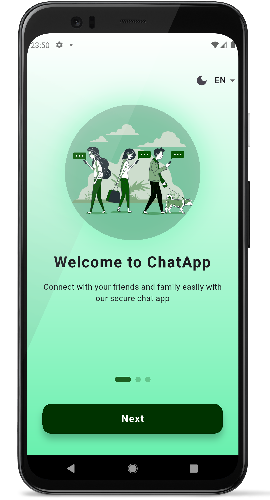
  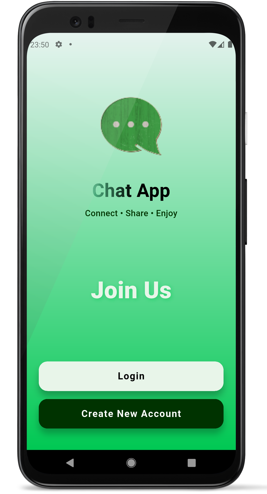
  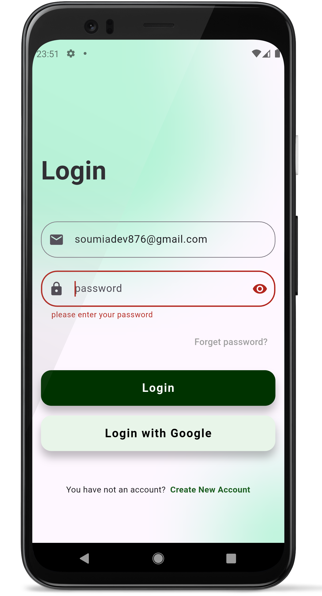
  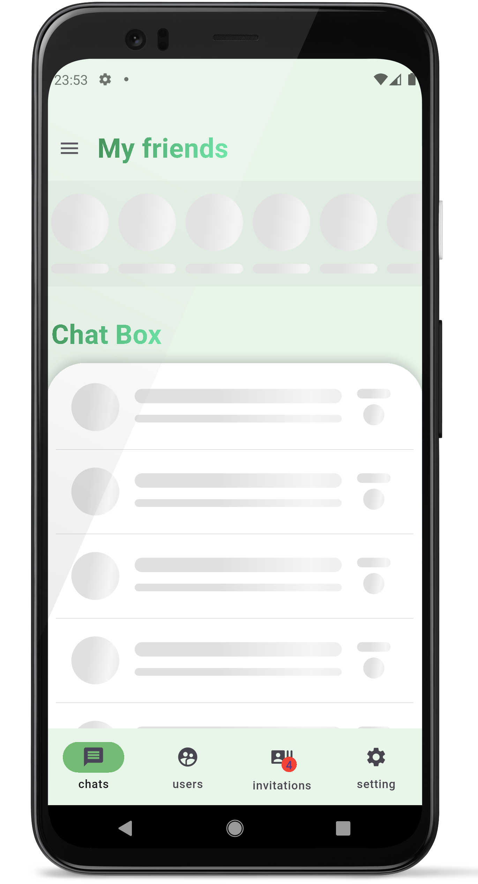

  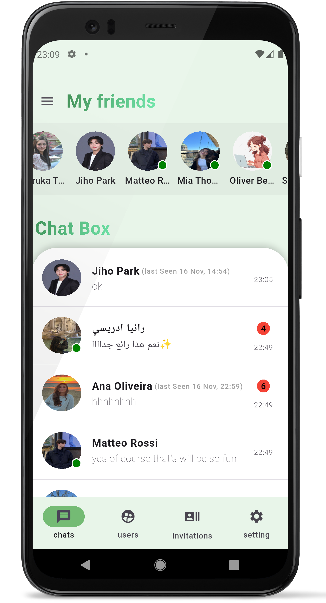
  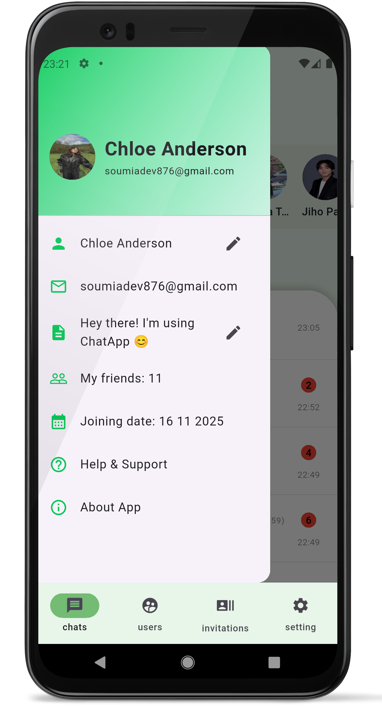
  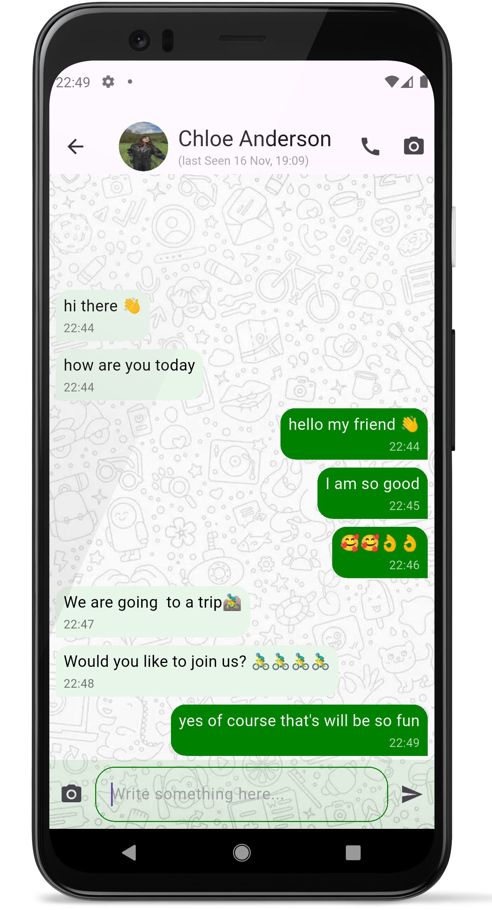
  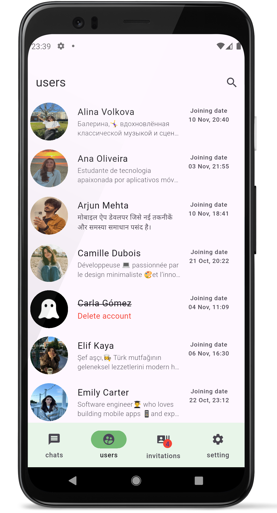

  
  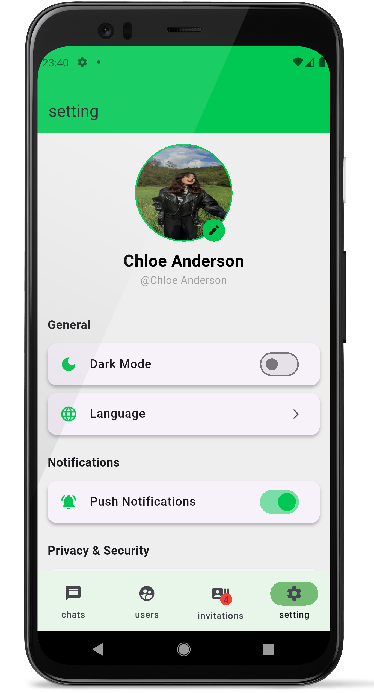
  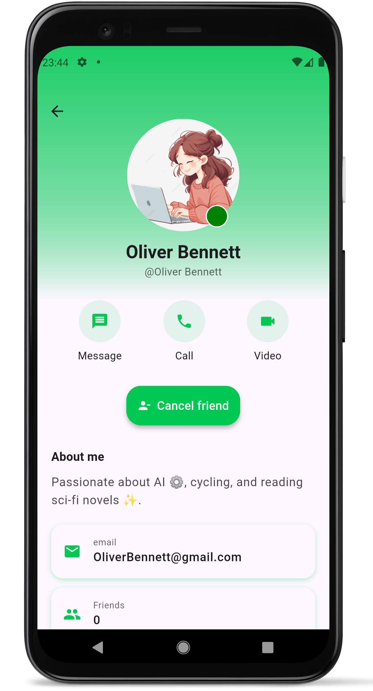
  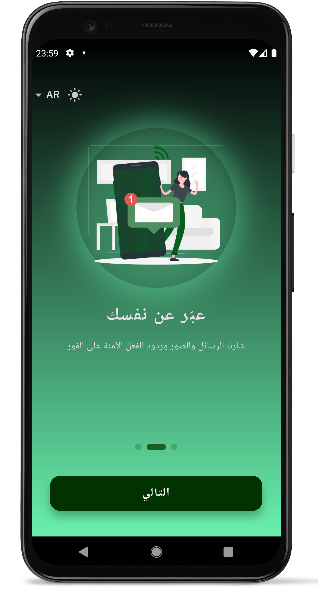

  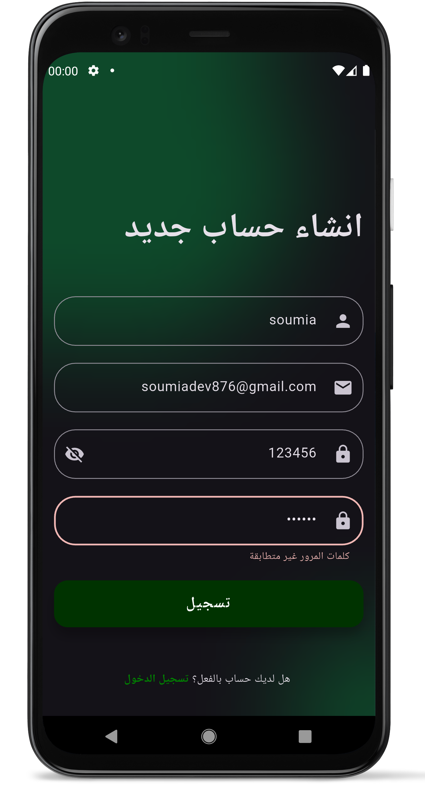
  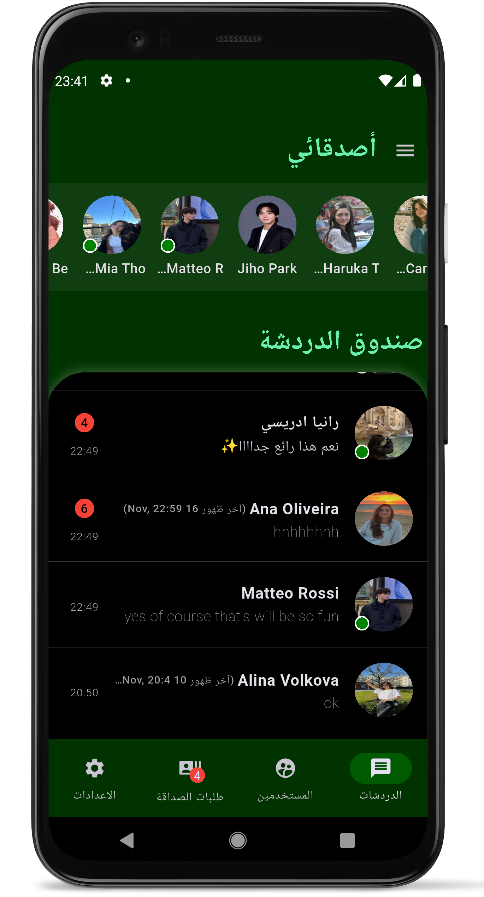
  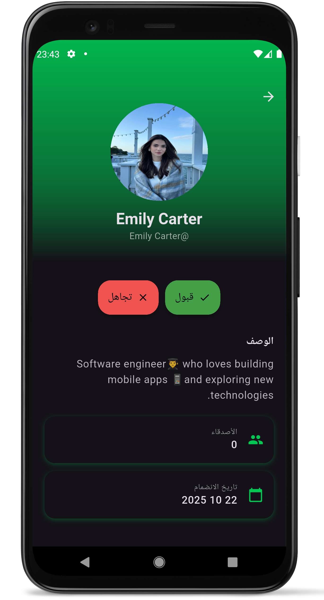
  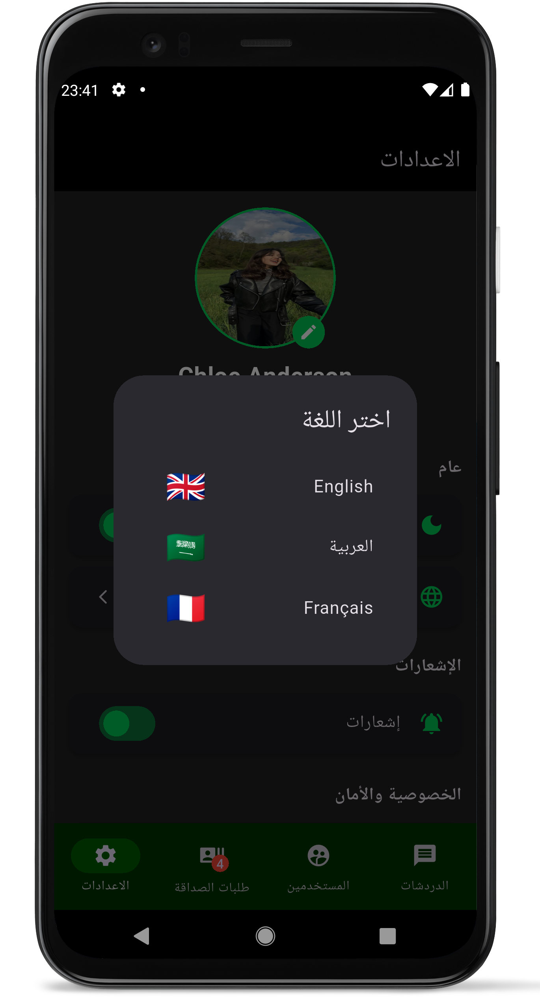

